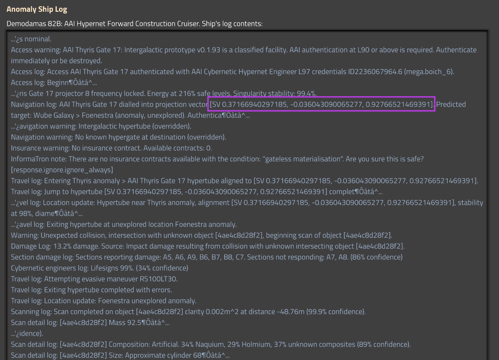
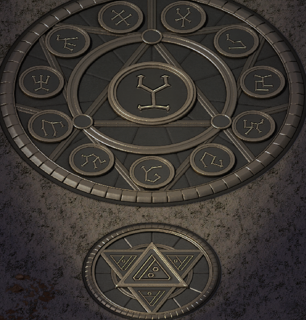
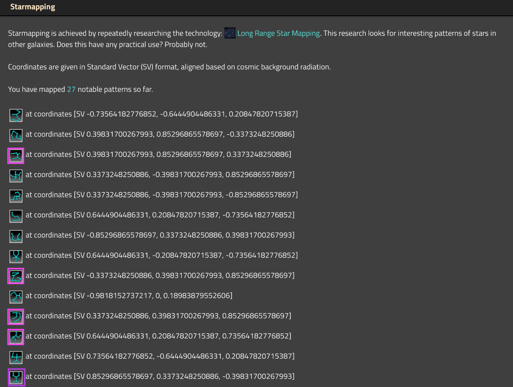
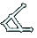
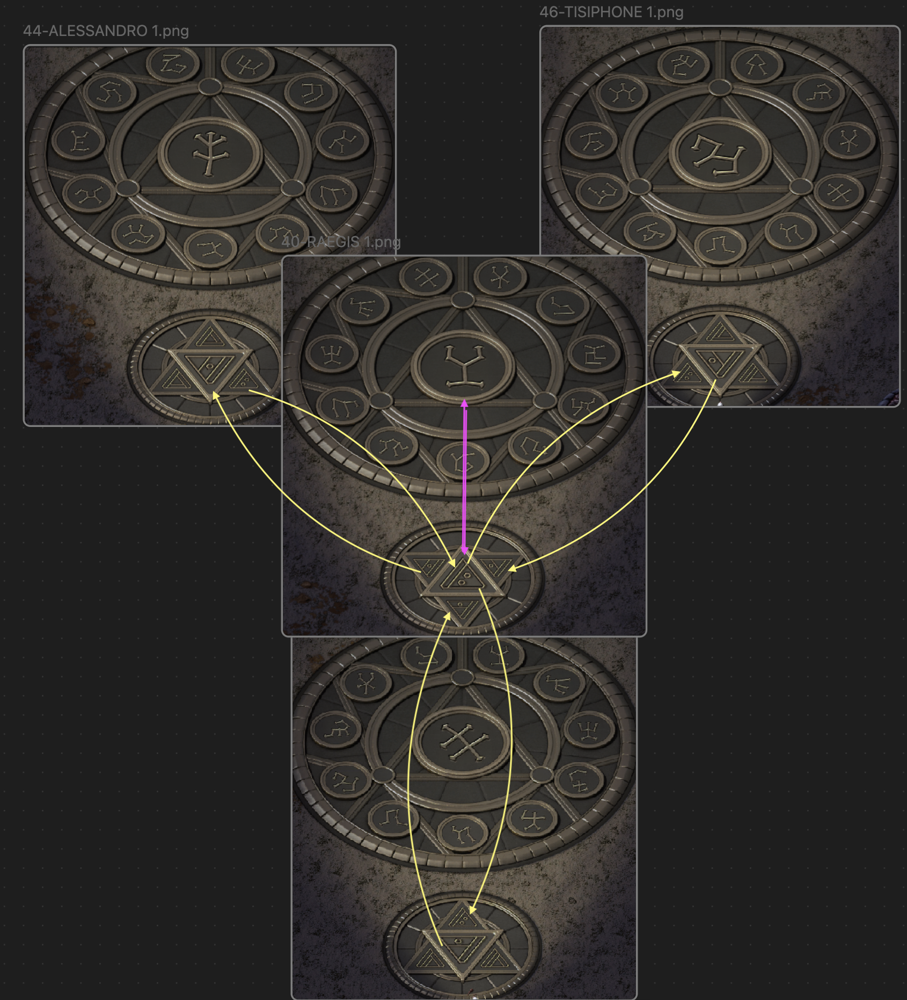

[Factorio](https://factorio.com/), with its [Space Exploration mod](https://mods.factorio.com/mod/space-exploration), is a captivating game that brought back memories of vector algebra, which I thought I'd forgotten. 

**⚠️ Important note**: If you plan to solve the puzzle yourself, this article may contain spoilers, so proceed with caution.

The game presents a unique puzzle-solving experience. While I found enough information to solve it on Reddit, I wanted to share my interactive graphical solution through this article.

https://github.com/megaboich/se-hypergate/assets/1382452/8a48e59f-e38b-4f2c-a0c9-6bf79a7af326


### Step 1: Check the Ship Log and Find the Destination Vector

The puzzle begins with a clue from the "Ship Log":



Here's the key information: the vector used to reach the gate:
```
[0.37166940297185, -0.036043090065277, 0.927665214693911]
```

To return, use the reverse vector:
```
[-0.37166940297185, 0.036043090065277, -0.927665214693911]
```

### Step 2: Get the Spherical Map for Space Navigation

The game includes 60 archaeological structures, each with pieces of the puzzle. Solving it allows you to convert coordinates into symbols for the star gate.

Here's a piece found in the archaeological artifact (Pyramid):



Each piece includes an upper circle and a bottom circle. The upper circle symbolizes one face of a 60-faced geometric figure called the [Pentakis Dodecahedron](https://en.wikipedia.org/wiki/Pentakis_dodecahedron). Each artifact corresponds to one face of this shape. Assuming we're at its center, finding the direction involves where a line from our position hits its surface.

To get initial coordinates for the symbols, do the "Star Mapping" research:



This research connects symbols with specific coordinates on the shape, intersecting precisely at the face's center.

Using circular diagrams, match all required faces with known symbols. Each diagram shows neighboring faces as seen from inside the Dodecahedron.


https://github.com/megaboich/se-hypergate/assets/1382452/522574ab-5a40-427a-b5d0-018aac73d157


### Step 3: Build a Triangular Map for Precision Location

To specify the target coordinates more precisely, split each triangular face into 64 smaller triangles. Identify each smaller triangle with the Star Gate using one of 60 symbols used for Dodecahedron faces, plus 4 additional symbols for corners and the center.

    

To map triangles to symbols, another piece of the puzzle from the bottom triangular archaeological structures is needed. Every symbol on the bottom triangles has a 1:1 mapping to the symbol used as input on the Star Gate.

 The diagram at the bottom shows which small sub-triangles are adjacent to the current symbol.



When combining all those small puzzle chains into the big picture the whole map of 64-sub-triangle surface could be assembled like this:


### Step 4: Find Corresponding Symbols for the Star Gate

The Star Gate accepts 8 symbols to specify the target vector destination. The first symbol defines the Dodecahedron facet, the second defines the sub-triangle, and subsequent symbols define further sub-triangles.

So the algorithm could be as straightforward as this:
1) Find the closest facet to your destination point.
2) Facet index is your first symbol to enter into the star gate.
3) Find the intersection point of your destination vector with the facet surface.
4) Find the closest sub-triangle index to your intersection point relative to your current triangle.
5) Sub-triangle index is the next symbol to enter into Star Gate.
6) Go to step #3 but with a newly obtained triangle for each step.

### Step 5: Enter Symbols into the Star Gate and Fine-Tune

Entering symbols incrementally increases energy consumption. To enter target coordinates, ensure a stable power capacity of 90GW.

Entering symbols in the wrong order may prevent the Star Gate from functioning properly or lead to hostile entities appearing. Laser turret defenses are recommended.

The Star Gate logs the target vector coordinates in the game journal after each attempt, aiding visualization and troubleshooting.

The Star Gate can also be used for positioning as an alternative to Star Mapping research: enter the first symbol of interest and repeat the symbol for the center of the triangle 7 times.
